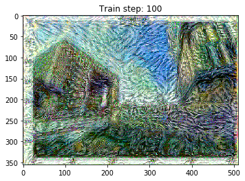

# TF2_DeepLearning_GenerativeModel
Here are some code examples of generative models, which are implemented with Tensorflow 2.4.0, results are shown as below: 

### Lab 2: PCA  
### Lab 3: Random Forest  
### Lab 4: Numerical Optimization  
### Lab 5: Regularization  
### Lab 6: Probabilistic Models  
### Lab 7: Non-Parametric Methods & SVMs  
### Lab 8: Cross Validation & Ensembling  
### Lab 11: Word2Vec  
### Lab 12: Convolutional Neural Networks
| origin image | train step 200 | train step 400 | train step 1000|
|:-------------:|:-----------:|:-------------------------------------:|:--------------------------------:|
|||||
### Lab 13: Seq2Seq Learning  
### Lab 14: GAN  
### Lab 16: Q-learning  
### Lab 17: DQN
### Competition 01: Predicting News Popularity  
### Competition 02: Object Detection & Localization  
### Competition 03: Reverse Image Caption  
### Competition 04: Flappy Bird with Policy Gradient  
